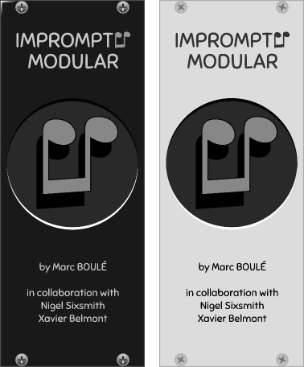
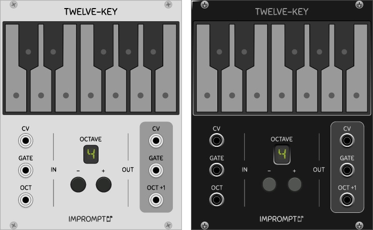
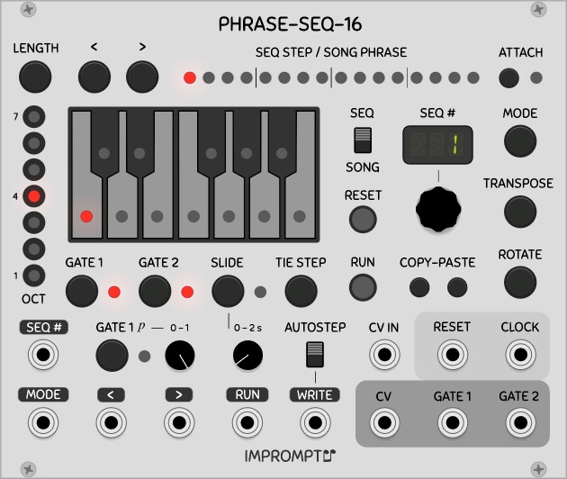
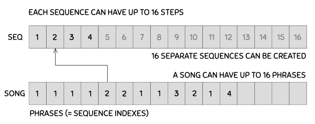
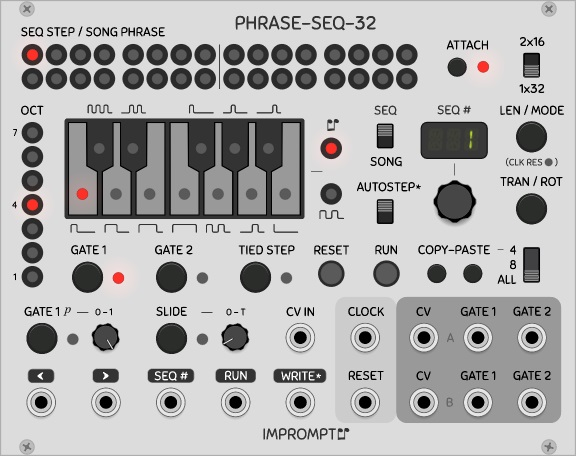
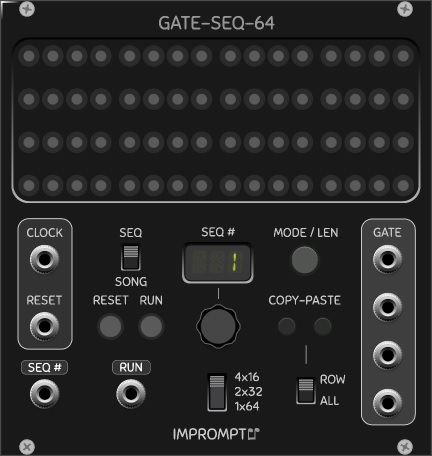
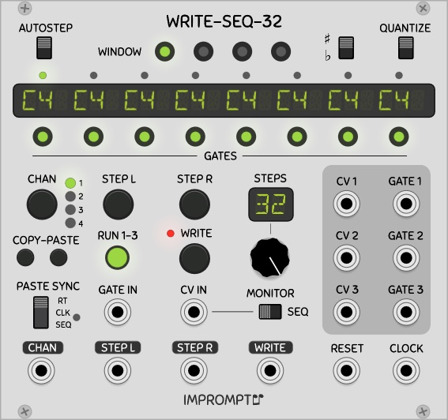
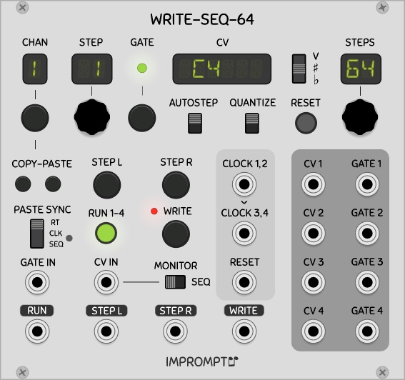

Modules for [VCV Rack](https://vcvrack.com), available in the [plugin manager](https://vcvrack.com/plugins.html).

Version 0.6.4

(For the 0.6.3 readme see [here](https://github.com/MarcBoule/ImpromptuModular/tree/cf63dcdb77934d41903414d20d3b744bd33f0a17))

[//]: # (!!!!!UPDATE VERSION NUMBER IN MAKEFILE ALSO!!!!!   120% Zoom for jpgs)

## License

Based on code from the Fundamental and Audible Instruments plugins by Andrew Belt and graphics from the Component Library by Wes Milholen. See ./LICENSE.txt for all licenses (and ./res/fonts/ for font licenses).

## Acknowledgements

Thanks to **Alfredo Santamaria** and **Nay Seven** for suggesting improvements to PhraseSeq16. Special thanks to **Xavier Belmont** for suggesting improvements to the PhraseSeq modules, for testing/bug-reports, for designing the blank panel and for graciously providing the dark panels of all modules. A very special thank you to **Nigel Sixsmith** for the many fruitful discussions and numerous design improvements that were suggested for the PhraseSeq modules, for the concept proposal and development of GateSeq64, for detailed testing/bug-reports, and also for the [in-depth presentation](https://www.youtube.com/watch?v=KOpo2oUPTjg) of PhraseSeq16 and TwelveKey. 

# Modules

Each module is available in light (Classic) or dark (Dark-valor) panels, selectable by right-clicking the module in Rack.

* [TwelveKey](#twelve-key): Chainable one-octave keyboard controller.

* [PhraseSeq16](#phrase-seq-16): 16-phrase sequencer with 16 steps per sequence, with onboard keyboard and CV input for easy sequence programming.

* [PhraseSeq32](#phrase-seq-32): 32-phrase sequencer with 32 steps per sequence, with onboard keyboard and CV input for easy sequence programming (can be configured as 1x32 or 2x16).

* [GateSeq64](#gate-seq-64): 16-phrase gate sequencer with 64 steps per sequence and per-step gate probability control, perfect for adding controlled randomness to your drum patterns (can be configured as 1x64, 2x32 or 4x16).

* [WriteSeq32](#write-seq-32): 3-channel 32-step sequencer with CV input for easy sequence programming.

* [WriteSeq64](#write-seq-64): 4-channel 64-step sequencer with CV input for easy sequence programming.

Details about each module are given below. Feedback and bug reports (and [donations!](https://www.paypal.me/marcboule)) are always appreciated!

## Known issues
For modules such as PhraseSeq16 and GateSeq64, it is advisable to have a core audio module added to your patch and assigned to a sound card in order for the response delays in the user interface to be of proper duration (for length selection and probability selection respectively in these two modules, for example). This is a [known artifact](https://github.com/VCVRack/Rack/issues/919) in VCV Rack.

## General Concepts 

Many Impromptu Modular sequencers feature a CV input for entering notes into the sequencers in a quick and natural manner when using, for example:

* a physical midi keyboard connected via the Core MIDI-1 module in VCV Rack;
* a software midi keyboard (such as [VMPK](http://vmpk.sourceforge.net/)) via the Core MIDI-1 module (a software midi loopback app may be required); 
* a keyboard within VCV Rack such as the Autodafe keyboard or [TwelveKey](#twelve-key). 

Such sequencers have two main inputs that allow the capturing of (pitch) CVs, as follows: The edge sensitive **WRITE** control voltage is used to trigger the writing of the voltage on the **CV IN** jack into the CV of the current step. Any voltage between -10V and 10V is supported, and when a sequencer displays notes via a built-in keyboard or a display showing note letters, non-quantized CVs are mapped to the closest note but are correctly stored in the sequencer.

When **AUTOSTEP** is activated, the sequencer automatically advances one step right on each write. For example, to automatically capture the notes played on a keyboard, send the midi keyboard's CV into the sequencer's CV IN, and send the keyboard's gate signal into the sequencer's Write input. With Autostep activated, each key-press will automatically be entered in sequence. An alternative way of automatically stepping the sequencer each time a note is entered is to send the gate signal of the keyboard to both the write and ">" inputs. 

All edge sensitive inputs are have a threshold of 1V. In all sequencers, the duration of the gates corresponds to the pulse width (high time) of the clock signal.

## TwelveKey 

A chainable keyboard controller for your virtual Rack. When multiple TwelveKey modules are connected in series from left to right, only the octave of the left-most module needs to be set, all other down-chain modules' octaves are set automatically. The aggregate output is that of the right-most module. To set up a chain of TwelveKey modules, simply connect the three outputs on the right side of a module to the three inputs of the next module beside it (typically to the right).

For a brief tutorial on setting up the controller, please see [this segment](https://www.youtube.com/watch?v=KOpo2oUPTjg&t=874s) or [this segment](https://www.youtube.com/watch?v=hbxlK07PQAI&t=4614s) of Nigel Sixsmith's Talking Rackheads series. Here are some specific details on each element on the faceplate of the module.

* **CV**: The CV output from the keyboard or its CV input, depending on which key was last pressed, i.e. an up-chain key (from a module to the left) or a key of the given keyboard module.

* **GATE**: Gate output signal from the keyboard or its gate input.

* **OCTAVE -/+**: Buttons to set the base octave of the module. These buttons have no effect when a cable is connected to the OCT input.

* **OCT**: CV input to set the base octave of the module. The voltage range is 0V (octave 0) to 9V (octave 9). Non-integer voltages or voltages outside this range are floored/clamped. 

* **OCT+1**: CV output for setting the voltage of the next down-chain TwelveKey module. This corresponds to the base octave of the current module incremented by 1V.

## PhraseSeq16 

A 16 phrase sequencer module, where each phrase is an index into a set of 16 sequences of 16 steps (maximum). CVs can be entered via a CV input when using an external keyboard controller or via the built-in keyboard on the module itself. If you need a 256-step sequence in a single module, this is the sequencer for you! With two separate gates per step, gate 2 is perfect for using as an accent if desired.

The following block diagram shows how sequences and phrases relate to each other to create a song. In the diagram, a 12-bar blues pattern is created by setting the song length to 12, the step lengths to 8 (not visible in the figure), and then creating 4 sequences. The 12 phrases are indexes into the 4 sequences that were created. (Not sure anyone plays blues in a modular synth, but it shows the idea at least!)

Familiarity with the Fundamental SEQ-3 sequencer is recommended, as some operating principles are similar in both sequencers. For an in depth review of the sequencer's capabilities, please see Nigel Sixsmith's [Talking Rackheads episode 8](https://www.youtube.com/watch?v=KOpo2oUPTjg). Here are some specific details on elements of the faceplate. 

* **SEQ/SONG**: This is the main switch that controls the two major modes of the sequencer. Seq mode allows the currently selected sequence to be played/edited. In this mode, all controls are available (run mode, transpose, rotate, copy-paste, gates, slide, octave, notes) and the content of a sequence can be modified even when the sequencer is running. Song mode allows the creation of a series of sequence numbers (called phrases). In this mode, only the run mode and length of the song and the sequence index numbers themselves can be modified (whether the sequence is running or not); the other aforementioned controls are unavailable and the actual contents of the sequences cannot be modified.

* **LENGTH**: When in Seq mode, this button allows the arrow buttons to select the length of sequences (number of steps), the default is 16. The sequences can have different lengths. When in Song mode, this button allows the arrow buttons to select the number of phrases in the song (the default is 4).

* **<, >**: These arrow buttons step the sequencer one step left or right. They have no effect when Attach is activated.

* **SEQ#**: In Seq mode, this number determines which sequence is being edited/played. In Song mode, this number determines the sequence index for the currently selected phrase; the selected phrase is shown in the 16 LEDs at the top of the module). When one of the Mode, Transpose, Rotate buttons is pressed, the display instead shows the current run mode (see Mode below), the amount of semi-tones to transpose, and the number of steps to rotate respectively. The SEQ# control voltage can be used to select the active sequence (Seq mode only), whereby a 0 to 10V input is proportionally mapped to the 1 to 16 sequence numbers. This can be used to externally control the playing order of the sequences.

* **ATTACH**: Allows the edit head to follow the run head (Attach on). The position of the edit head is shown with a red LED, and the position of the run head is shown with a green LED. When in Seq mode, the actual content of the step corresponding to the edit head position (i.e. note, oct, gates, slide) can be modified in real time whether the sequencer is running or not. The edit head automatically follows the run head when Attach is on, or can manually positioned by using the < and > buttons when Attach is off.

* **MODE**: This controls the run mode of the sequences and the song (one setting for each sequence and one for the song). The modes are: FWD (forward), REV (reverse), PPG (ping-pong, also called forward-reverse), BRN (Brownian random), RND (random). For example, setting the run mode to FWD for sequences and to RND for the song will play the phrases that are part of a song randomly, and the probability of a given phrase playing is proportional to the number of times it appears in the song.

* **TRAN/ROT**: Transpose/Rotate the currently selected sequence up-down/left-right by a given number of semi-tones/steps. The main knob is used to set the transposition/rotation amount. Only available in Seq mode.

* **COPY-PASTE**: Copy and paste the CVs, gates, slide and tied attributes of a part or all of a sequence into another sequence. When ALL is selected, run mode and length are also copied. Only available in Seq mode.

* **OCT and keyboard**: When in Seq mode, the octave LED buttons and the keyboard can be used to set the notes of a sequence. The octave and keyboard LEDs are used for display purposes only in Song mode with attach on.

* **GATE 1, 2 buttons and probability knob**: The gate buttons control whether the gate of a current step is active or not. The probability knob controls the chance that when gate 1 is active it is actually sent to its output jack. In the leftmost position, no gates are output, and in the rightmost position, gates are output exactly as stored in a sequence. This knob's probability setting is not memorized for each step and applies to the sequencer as a whole.

* **SLIDE**: Portamento between CVs of successive steps. Slide can be activated for a given step using the slide button. The slide duration can be set using the slide knob. The slide duration can range from 0 to T seconds, where T is the duration of a clock period (the default is 10% of T). This knob's setting is not memorized for each step and applies to the sequencer as a whole.

* **TIED STEP**: When CVs are intended to be held across subsequent steps, this button can be used to tie the CV of the previous step to the current step; when tied, the gates of the current step are automatically turned off. If the CV of the head note changes, all consecutive tied notes are updated automatically.

## PhraseSeq32 

A 32 phrase sequencer module, where each phrase is an index into a set of 32 sequences of 32 steps (maximum). If you need a 1024-step sequence in a single module, this is the sequencer for you! This sequencer is very similar to [PhraseSeq16](#phrase-seq-16), but with an added configuration switch allowing the sequencer to output dual 16 step sequences (**2x16**) instead of single 32 step sequences (**1x32**).

Step/phrase selection is done by directly clicking the 32 steps at the top, instead cursor buttons as used in PhraseSeq16. When running in the 2x16 configuration and in Seq mode, with **ATTACH** activated, simply click any step in a given row to attach the edit head to that row.

The length of sequences can be set using the **MODE/LEN** button (click twice) and then clicking the desired length directly in the steps or turning the main knob below the main display.

When the 1x32 configuration is selected, only the top channel outputs are used (labeled A), and when the 2x16 configuration is selected, the top row is sent to the top outputs (CV and gates A), whereas the bottom row of steps is sent to the bottom outputs (CV and gates B). Other than these characteristics, the rest of the functionality of PhraseSeq32 is identical to that of PhraseSeq16.

## GateSeq64 

A 64 step gate sequencer, with an added configuration switch allowing the sequencer to output quad 16 step sequences or dual 32 step sequences, instead of single 64 step sequence. The main feature of GateSeq64 is the ability to define **probabilities** for each step. When activating a given step by clicking it once, it will turn green showing that the step is on. Clicking the step again turns it yellow, and the main display shows the probability associated with this step. While the probability remains shown, the probability can be adjusted with the main knob, in 0.02 increments, between 0 and 1. When a yellow step is selected, clicking it again will turn it off.

This sequencer also features the song mode found in [PhraseSeq16](#phrase-seq-16); 16 phrases can be defined, where a phrase is an index into a set of 16 sequences. In GateSeq64, the song steps are shown using the fourth row of steps, overlapped with the actual sequence progression in lighter shades in the lights. 

The **SEQ** CV input and run **MODES** are identical to those found in PhraseSeq16, and selecting sequence lengths is done in the same manner as described in [PhraseSeq32](#phrase-seq-32). Copy-pasting **ALL** also copies the run mode and length of a given sequence, along with gate states and probabilities, whereas only gates and probabilities are copied when **ROW** is selected.

When running in the 4x16 configuration, each of the four rows is sent to the four **GATE** output jacks (jacks 1 to 4, 1 being the top-most jack). In the 2x32 configuration, jacks 1 and 3 are used, and in the 1x64 configuration, only jack 1 is used (top-most jack). The pulse width of the gates emitted corresponds to the pulse width of the clock.

## WriteSeq32 

A three channel 32-step writable sequencer module. Although the display shows note names (ex. C4#, D5, etc.), any voltage within the -10V to 10V range can be stored/played in the sequencer, whether it is used as a pitch CV or not, and whether it is quantized or not. Gate states and window selection can be done by pressing the 8 and 4 LED buttons respectively located below and above the main display. 

Here are some specific details on each element on the faceplate of the module. Familiarity with the Fundamental SEQ-3 sequencer is recommended, as some operating principles are similar in both sequencers.

* **WINDOW**: LED buttons to display/select the active 8-step window within the 32 step sequence (hence four windows). No effect on channels 1 to 3 when the sequencer is running.

* **QUANTIZE**: Quantizes the CV IN input to a regular 12 semi-tone equal temperament scale. Since this quantizes the CV IN, some channels can have quantized CVs while others do not. 

* **Main display**: Shows the note names for the 8 steps corresponding to the active window. When a stored pitch CV has not been quantized, the display shows the closest such note name. For example, 0.03 Volts is shown as C4, whereas 0.05 Volts is shown as C4 sharp or D4 flat. Octaves above 9 or below 0 are shown with a top bar and an underscore respectively.

* **GATES**: LED buttons to show/modify the gates for the 8 steps in the current window. Gates can be toggled whether the sequencer is running or not.

* **CHAN**: Selects the channel that is to be displayed/edited in the top part of the module. Even though this is a three channel sequencer, a fourth channel is available for staging a sequence while the sequencer is running (or not). 

* **COPY-PASTE**: Copy and paste the CVs and gates of a channel into another channel. All 32 steps are copied irrespective of the Steps knob setting.

* **PASTE SYNC**: Determines whether to paste in real time (RT), on the next clock (CLK), or at the start of the next sequence (SEQ). Pending pastes are shown by a red LED beside CLK/SEQ, and if the selected channel changes, the paste operation will be performed in the channel that was selected when the paste button was pressed. Paste operations into the staging area (channel 4) are always done in real time, irrespective of the state of the paste sync switch. To cancel a pending paste, press the Copy button again.

* **<, >**: These buttons step the sequencer one step left or right. No effect on channels 1 to 3 when the sequencer is running. A rising edge on the </> control voltage inputs triggered at 1V will also step the sequencer left/right by one step.

* **RUN 1-3**: Start/stop the sequencer. When running, the sequencer responds to rising edges of the clock input and will step all channels except the staging area (channel 4). When Run is activated, the sequencer automatically starts playing at the first step. A rising edge on the RUN input will also toggle the run mode.

* **GATE IN**: Allows the gate of the current step/channel to also be written during a Write (see [General Concepts](#general-concepts) above). If no wire is connected, the input is ignored and the currently stored gate is unaffected. No effect on channels 1 to 3 when the sequencer is running.

* **STEPS**: Sets the number of steps for all the sequences (sequence length).

* **MONITOR**: This switch determines which CV will be routed to the currently selected channel's CV output when the sequencer is not running. When the switch is in the right-most position, the CV stored in the sequencer at that step is output; in the left-most position, the CV applied to the CV IN jack is output.

## WriteSeq64 

A four channel 64-step writable sequencer module. This sequencer is based on [WriteSeq32](#write-seq-32), both of which share many of the same functionalities. Familiarity with WriteSeq32 is strongly recommended. This sequencer is more versatile than WriteSeq32 since each channel has its own step position and maximum number of steps (length). Sequences of different lengths can be created, with different starting points. A fifth channel is available to be used as a staging area. 

WriteSeq64 has dual clock inputs, where each controls a pair of channels. When no wire is connected to **CLOCK 3,4**, the **CLOCK 1,2** signal is used internally as the clock for channels 3 and 4. 

Ideas: The first part of the famous [Piano Phase](https://en.wikipedia.org/wiki/Piano_Phase) piece by Steve Reich can be easily programmed into the sequencer by entering the twelve notes into channel 1 with a keyboard, setting STEPS to 12, copy-pasting channel 1 into channel 3, and then driving each clock input with two LFOs that have ever so slightly different frequencies. Exercise left to the reader!
