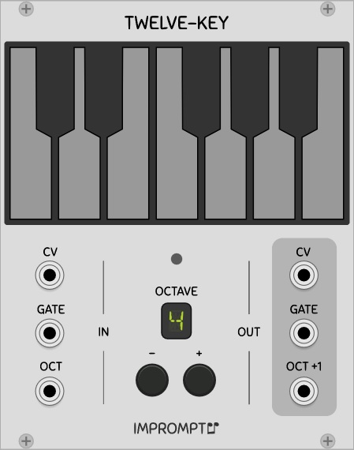
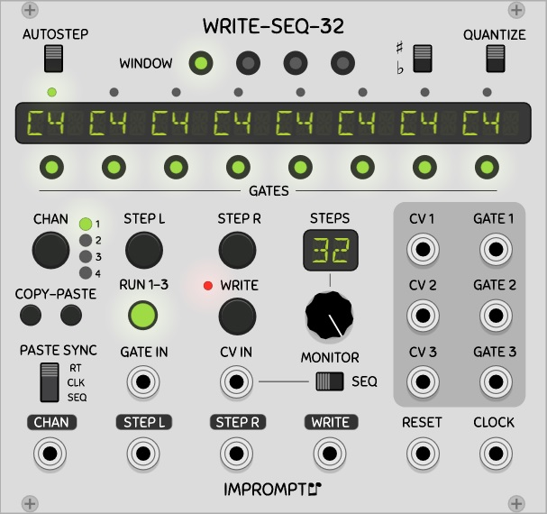
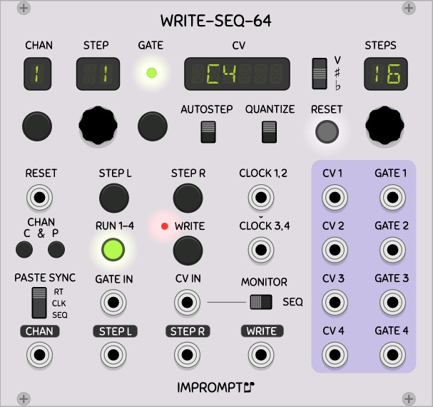
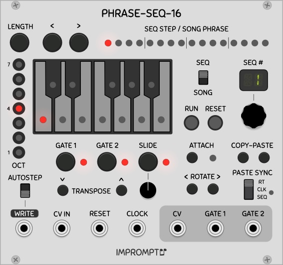
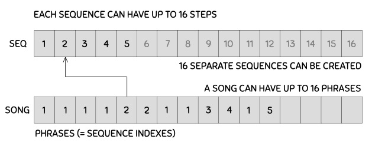

# Impromptu Modular: Modules for [VCV Rack](https://vcvrack.com) by Marc Boulé

Version 0.6.2

[//]: # (!!!!!UPDATE VERSION NUMBER IN MAKEFILE ALSO!!!!!)

Available in the VCV Rack [plugin manager](https://vcvrack.com/plugins.html).

## License

Based on code from the Fundamental and Audible Instruments plugins by Andrew Belt and graphics from the Component Library by Wes Milholen.

See ./LICENSE.txt for all licenses (and ./res/fonts/ for font licenses).

## Modules

* [Twelve-Key](#twelve-key): Chainable one octave keyboard controller.

* [Write-Seq-32](#write-seq-32): 32-step sequencer with CV in for easy sequence programming.

* [Write-Seq-64](#write-seq-64): 64-step sequencer with CV in for easy sequence programming.

* [Phrase-Seq-16](#phrase-seq-16): 16-phrase sequencer with 16 steps per sequence.

Details about each module are given below. Feedback and bug reports are always appreciated!

# Twelve-Key 

A chainable keyboard controller for your virtual Rack. When multiple Twelve-Key modules are connected in series from left to right, only the octave of the left-most module needs to be set, all other downchain modules' octaves are set automatically. The aggregate output is that of the right-most module. To set up a chain of Twelve-Key modules, simply connect the three ouputs on the right side of a module to the three inputs of the next module beside it (typically to the right).

Here are some specific details on each element on the faceplate of the module.

* **CV output**: Outputs the CV from the keyboard or its CV input, depending on which key was last pressed (an up-chain key or a key of the given keyboard module).

* **Gate output**: Gate signal from the keyboard or its gate input.

* **Octave +/-**: Buttons to set the base octave of the module. These buttons have no effect when a cable is connected to the OCT input.

* **Oct**: CV input to set the base octave of the module. The voltage range is 0V (octave 0) to 9V (octave 9). Non-integer voltages or voltages outside this range are floored/clamped. 

* **Oct+1**: CV output for setting the voltage of the next down-chain Twelve-Key module. This corresponds to the base octave of the current module incremented by 1V.

# Write-Seq-32 

A three channel 32-step writable sequencer module. This sequencer was designed to allow the entering of notes into a sequencer in a quick and natural manner when using, for example:

* a midi keyboard connected via the Core MIDI-1 module in VCV Rack;
* a software midi keyboard such as [VMPK](http://vmpk.sourceforge.net/) (a software midi loopback app may be required); 
* a keyboard within Rack such as the Autodafe keyboard or [Twelve-Key](#twelve-key). 

Although the display shows note names (ex. C4#, D5, etc.), any voltage within the -10V to 10V range can be stored/played in the sequencer, whether it is used as a pitch CV or not, and whether it is quantized or not.

Ideas: send the midi keyboard's CV into the the sequencer's CV in, and send the keyboard's gate signal into the sequencer's _write_ input. With autostep activated, each key-press will automatically be entered in sequence. Gate states and window selection can be done by pressing the 8 and 4 LED buttons respectively, located below and above the main display. 

Here are some specific details on each element on the faceplate of the module. Familiarity with Fundamental SEQ-3 sequencer is recommended, as some operating principles are similar in both sequencers.

* **Autostep**: Will automatically step the sequencer one step right on each write. No effect on channels 1 to 3 when the sequencer is running.

* **Window**: LED buttons to display the active 8-step window from the 32 step sequence (hence four windows). No effect on channels 1 to 3 when the sequencer is running.

* **Sharp / flat**: determines whether to display notes corresponding to black keys using either the sharp or flat symbols used in music notation. See _Notes display_ below for more information.

* **Quantize**: Quantizes the CV IN input to a regular 12 semi-tone equal temperament scale. Since this quantizes the CV IN, some channels can have quantized pitches while others do not. 

* **Step LEDs**: Shows the current position of the sequencer in the given window.

* **Notes display**: Shows the note names for the 8 steps corresponding to the active window. When a stored pitch CV has not been quantized, the display shows the closest such note name. For example, 0.03 Volts is shown as C4, whereas 0.05 V is shown as C4 sharp or D4 flat. Octaves above 9 or below 0 are shown with a top bar and an underscore respectively.

* **Gates**: LED buttons to show/modify the gate enables for the 8 steps in the current window. See _Gate 1-3_ below for more information on gate signals. Gates can be toggled whether the sequencer is running or not.

* **Chan**: Selects the channel that is to be displayed/edited in the top part of the module. Even though this is a three channel sequencer, a fourth channel is available for staging a sequence while the sequencer is running (or not). 

* **Copy-Paste**: Copy and paste the CVs and gates of a channel into another channel. In a given channel, press the left button to copy the channel into a buffer, then select another channel and press the right button to paste. All 32 steps are copied irrespective of the STPES knob setting.

* **Paste sync**: Determines whether to paste in real time (RT), on the next clock (CLK), or at the next sequence start (SEQ). Pending pastes are shown by a red LED beside CLK/SEQ, and if the selected channel changes, the paste opertion will be performed in the channel that was selected when the paste button was pressed. Pending pastes into the staging area (channel 4) are always done in realtime, irrespective of the state of the paste sync switch.

* **Step L/R**: Steps the sequencer one step left or right. No effect on channels 1 to 3 when the sequencer is running.

* **Run 1-3**: When running, the sequencer responds to rising edges of the CLOCK input and will step all channels except the staging area (channel 4).

* **Write**: This writes the pitch CV connected to the CV IN jack into the CV of the current step of the selected channel. If a wire is connected to GATE IN, this gate input is also written into the gate enable of the current step/channel. An enabled gate corresponds to a voltage of 1.0V or higher. The small LED indicates if writing via the write button is possible (green) or not (red).

* **CV In**: This pitch CV is written into the current step of the selected channel. Any voltage between -10.0V and 10.0V is supported. See _Notes display_ and _Quantize_ above for more related information. No effect on channels 1 to 3 when the sequencer is running.

* **Gate In**: Allows the state of the gate of the current step/channel to be written. If no wire is connected, input is ignored and the currently stored gate is unaffected. No effect on channels 1 to 3 when the sequencer is running.

* **Steps**: Sets the number of steps in all the sequences (sequence length). Since all channels are synchronized to the same clock, this applies to all sequences (i.e. sequences are all of the same length).

* **Monitor**: this switch determines which pitch CV will be routed to the currently selected channel's CV output. When the switch is in the right position, the pitch CV stored in the sequencer at that step is output, whereas in the left position the pitch CV applied to the CV IN jack is output. Has no effect when the sequencer is running.

* **CV 1-3**: pitch CV outputs of each channel at the current step.

* **Gate 1-3**: Gate signal outputs for each channel at the current step. The duration of the gates corresponds to the high time of the clock signal.

* **Chan input**: control voltage for channel selection (CHAN button). A rising edge triggered at 1.0V will increment the channel selection by one.

* **Write input**: control voltage for writing CVs into the sequencer (WRITE button). A rising edge triggered at 1.0V will perform the write action (see _Write_ above).

* **Step L/R inputs**: control voltages for step selection (STEP L/R buttons). A rising edge triggered at 1.0V will step the sequencer left/right by one step.

* **Reset input**: repositions the sequencer at the first step. A rising edge triggered at 1.0V will be detected as a reset. Pending pastes are also cleared.

* **Clock**: when the sequencer is running, each rising edge (1.0V threshold) will advance the sequencer by one step. The width (duration) of the high pulse of the clock is used as the width (duration) of the gate outputs. 

# Write-Seq-64 

A four channel 64-step writable sequencer module. This sequencer is based on Write-Seq-32, both of which share many of the same functionalities. Write-Seq-64 has dual clock inputs (each controls a pair of channels). This sequencer is more versatile than Write-Seq-32 since each channel has its own step position and maximum number of steps. Sequences of different lengths can be created, with different starting points.

Ideas: The first part of the famous [Piano Phase](https://en.wikipedia.org/wiki/Piano_Phase) piece by Steve Reich can be easily programmed into the sequencer by entering the twelve notes into channel 1 with a midi keyboard, setting STEPS to 12, copy-pasting channel 1 into channel 3, and then driving each clock input with two LFOs that have ever so slightly different frequencies. Exercise left to the reader!

Here are some specific details on elements of the faceplate which differ compared to Write-Seq-32. Familiarity with Write-Seq-32 is strongly recommended.

* **Chan**: Four channels available, with a fifth channel that can be used as a staging area.

* **Gate LED and CV display**: Status of the gate and CV of the currently selected step.

* **Steps**: Sets the number of steps of the currently selected sequence (sequence length). Each channel can have different lengths. This value is included as part of a copy-paste operation.

* **Reset input/button**: repositions all channels to their first step. A rising edge triggered at 1.0V will be detected as a reset. Pending pastes are also cleared.

* **Clock 1,2**: Clock signal for channels 1 and 2.

* **Clock 3,4**: Clock signal for channels 3 and 4. If no wire is connected, _Clock 1,2_ is used internally for channels 3 and 4.

# Phrase-Seq-16 

A 16 phrase sequencer module where each phrase is an index into a set of 16 defined sequences of 16 steps (maximum). CVs can be entered via a CV input when using an external keyboard controller or via the builtin keyboard on the module itself.

Ideas: If you need a 256-step sequence in one module, this is the sequencer for you!

The following block diagram shows how sequences and phrases relate to each other to create a song. In the diagram, a 12-bar blues pattern is created by setting the song length to 12, the step lengths to 8 (not visible in the figure), and then creating 4 sequences. The 12 phrases are indexes into the 4 sequences that were created.

Here are some specific details on elements of the faceplate. Familiarity with Fundamental SEQ-3 sequencer is recommended, as some operating principles are similar in both sequencers. 

* **Seq/Song**: This is the main switch that controls the two major modes of the sequencer. When in Seq mode with a running sequencer, the sequencer plays the currently selected sequence indicated by the Seq# knob. In this mode, all controls are available (transpose, rotate, copy-paste, gates, slide, octave, notes). When the sequencer is in Song mode and is running, the sequencer plays the sequences indexed by the series of phrases. In this mode, the aforementioned controls are unavailable.

* **Length**: When in SEQ mode, allows the arrow buttons to select the length of sequences (number of steps, the default is 16). All sequences have the same length. When in SONG mode, allows the arrow buttons to select the number of phrases in the song (the default is 4).

* **Seq#**: In Seq mode, this number determines which sequence is being editied/played. In Song mode, this number determines the sequence index for the currently selected phrase; the selected phrase is shown in the 16 LEDs at the top of the module).

* **Attach**: Allows the edit head to follow the run head (attach on). The position of the edit head is shown with a red LED, and the position of the run head is shown by a green LED. When in Sequence mode, the actual content of a step (i.e. note, oct, gates, slide) of the sequence can be modified in real time as the sequencer is advancing (_attach_ on), or manually by using the < and > buttons (_attach_ off).

* **Oct and keyboard**: When in Sequence mode, the octave LED buttons and the keyboard can be used to set the notes of a sequence.

* **CV In**: This pitch CV is written into the current step of the selected sequence. Any voltage between -10.0V and 10.0V is supported. When a pitch is not quantized, the closest key is illuminated; octaves greater than 7 or smaller than 1 are not displayed by the octave LEDs.

* **Write input**: control voltage for writing CVs into the sequencer. A rising edge triggered at 1.0V will perform the write action.

* **Autostep**: Will automatically step the sequencer one step right on each write. This works with the _Write input_ only, and has no effect when entering notes with the onboard keys.

* **Gate 1, 2**: Gate signal outputs for each channel at the current step. The duration of the gates corresponds to the high time of the clock signal. Gates can be turned on/off using the Gate buttons. Gate 2 is perfect for using as an acctent if desired.

* **Slide**: Typical portamento between CVs of successive steps. Slide can be activated for a given step using the slide button. The slide duration (0 to 2 seconds) can be set using the small knob below the slide button. This knob's setting is not memorized for each step, it applies to the sequencer as a whole.

* **Transpose**: Increse/decrease the CVs of the currently selected sequence by one semitone. Only available in Seq mode.

* **Rotate**: Rotate (left or right) the steps of the currently selected sequence by one step. Only available in Seq mode.

* **Copy-Paste**: Copy and paste the CVs, gates and slide states of a sequence into another sequence. Press the left button to copy the channel into a buffer, then select another sequence and press the right button to paste. All 16 steps are copied irrespective of the length of the sequences. Only available in Seq mode.

* **Paste sync**: Determines whether to paste in real time (RT), on the next clock (CLK), or at the next sequence start (SEQ). Pending pastes are shown by a red LED beside CLK/SEQ, and if the selected sequence changes, the paste opertion will be performed in the sequence that was selected when the paste button was pressed.

* **CV**: pitch CV output of the sequence/song the current step.

* **Reset input/button**: repositions the run and edit heads of the sequence or song to the first step. A rising edge triggered at 1.0V will be detected as a reset. Pending pastes are also cleared.

* **Clock**: when the sequencer is running, each rising edge (1.0V threshold) will advance the sequencer by one step. The width (duration) of the high pulse of the clock is used as the width (duration) of the gate outputs. 
